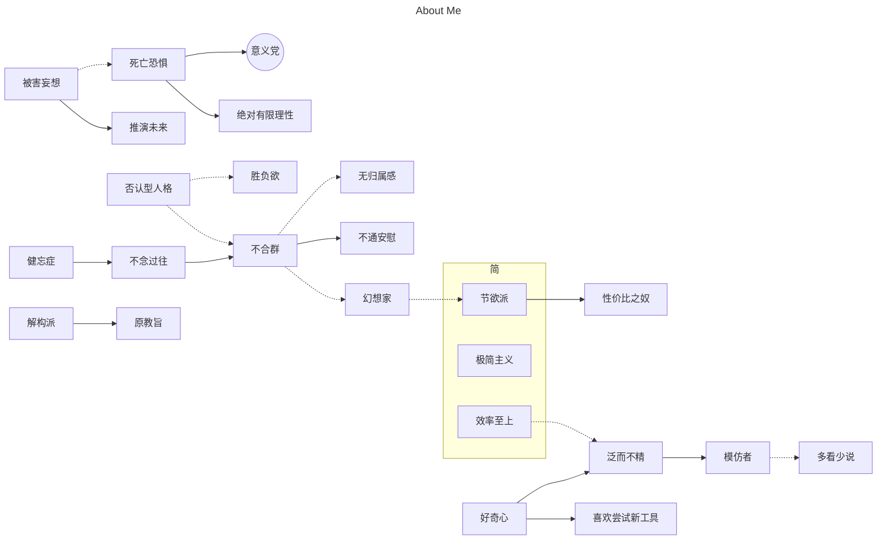

# 关于作者更加详细的回答

<!-- https://mermaid.js.org/syntax/flowchart.html -->

- 世界观 + 人生观：[道论](../gossip/worldview.md)
- 价值观：[杂论](../gossip/va_view.md)



## 标签 QA

- 什么是意义党？
  - 个人定义 `意义党`：`只做自认为有意义的事。` 以充实消去罪恶。从高三开始初步形成这种思想，并在上大学后强化，成为人生态度。
- 为什么会成为意义党？ _关联[被害妄想](../hide/personal_details.md#深层性格)，[意义道](../gossip/worldview.md#意义道)_
  - 幻想自己死掉以后的种种。世界仍然在行进，我却没有意识感受这一切。这会让我感到恐惧。人生长则百年，短则随时都可能死亡。我需要做一些有意义的事来对抗幻想中的虚无。
- 为什么 _非纯粹_ ？
  - 自控力差。明知道某些游戏没有任何意义，却还是忍不住玩下去。这与意义党的理念相悖。~~（虽然也有戒游戏成功的例子[^3]，但大体上还是摇摆不定的）~~
  - 做出违背意义举动时会有罪恶感。
- 如何理解有限理性？
  - 总的来说，理性占据上风。沉浸于二次元时，会短时感性。
  - 小事理性，但是当遇到重要的抉择时，不容易下定决心。
- 节欲派？
  - 追求精神世界的充实，而减少物质世界的欲望。
  - 通过节欲，面临两难选择时得以不违本心。
- 旋律党？
  - 喜欢的音乐 _（听觉艺术）_ 需要旋律优美。不接受空有节奏无旋律的曲子、rap & 脱口秀、嘈杂的音乐。<heimu>点名某些音游曲！</heimu>
- 自由主义？
  - 版权反对者，主张自由开源；注重结果，主张低限约束。
- 幻想者？
  - 幼时沉醉幻想。今回想之，非如此界人。
  - 从古至今，持续读书幻想。
  - 幻想者当入画道。然吾已忘前所学皮毛，感慨颇多。
- _音游人_ 跟 _意义党_ 是否冲突？
  - 我觉得打音游是比较有意义的消遣方式。~~除了提高反应能力与手指灵活度，接触旋律优美的音乐等等~~，音游还能让我有变强的实感。音游所具有的意义能大大降低我的罪恶感。
- 模仿者？
  - 注重应用而非理论。而模仿者付出的成本更低。
- 边缘二次元人[^2]？
  - 与二次元的联系主要体现在 galgame 和看色图上。
  - 不玩二游，不买周边，不看漫，不推 v，不看 c，不参与交流。
  - 由 _剧情党_，不对特定角色投入过多感情。
- 无节日主义者？
  - 反对节日带来的常轨脱离、额外开销与牺牲少数派利益的做法。

[^2]: [特定范围内的二次元文化](../hobbies/anime.md)

[^3]: 成功戒掉了 [csgo](../hobbies/other_games/csgo.md)（不含 cs2）

## [我的回忆录](./memories.md)

## 其他性格

- 被害妄想
  - 鱼钩，高空坠物，寻仇者，钉子，各种交通工具
  - 眼球相关。~~（人的眼球是极为脆弱的~~
  - 遵循风险最小化原则，楼层不高的情况下绝不坐电梯
  - 寄生虫恐惧症：常想象肚子里有寄生虫。并且会主动寻找看起来像的症状。一段时间会吃一次阿苯达挫。~~（考虑与其他药物混合使用中）~~
- 不擅长安慰他人。也不需要被别人安慰。
- 在小说的影响下，（仅）敬畏内在性 强者。

## 其他习惯

- 不愿意打电话吵别人，也不喜欢被响铃打扰。
- 喜欢吃糖与吃辣。
- 心情与天气相关性较大，雨天（及其衍生现象）会导致心情不好
- 有时会“\*思泉涌”，即大脑运转速度加速，出现很多灵感与其他思考。有在这些时刻出现过：
  - 睡前接受了过多信息或想到了很多事情。可以想起本应想不起的事情，获得一些灵感，幻想一些难以实现的豪情壮志。可能需要拿起手机记下代办事项与灵感，也导致难以入眠。
  - 遭遇消极的 事件，或推演到了消极的未来。
  - 没事干时对眼前的信息进行的思考与批判。
- 侧睡党，几乎不打呼噜
- 洗完手习惯把水往额头上抹（给 cpu 降温 x
- 不擅长恐怖 & 悬疑 & 惊悚。
- 倾向于在狭小空间独处并将空间利用率最大化。
- 短时高注意力水平（2.5 倍），在 1-2h 后逐渐衰减。
  - 特别是在发烧、思考和考试的时候，可以进一步排除噪音影响。
  - 由于此模型影响，上课时间听课效率过低（讲课速度无法跟上注意力倍率），选择自学其他学科内容。
- 对任何环境的低音量有很大需求，特别是坐在电脑前的时候。~~曾不止一次想打爆学校的广播喇叭~~

## 特质与能力

- 高代谢水平（异常多的油脂分泌、头屑、囊肿；频繁脱皮<span class="heimu" title="你知道的太多了">看起来像是寿元不多的样子</span>）
- 低肺活，高 BOLT 值
- 拥有不错的时感，方差较低，但极差较高。
- [抗饿](../hide/memories.md#饿)
- 引用计数模型，一般不会在上课、洗澡时丢东西

## 模型

### 睡眠

```rs
fn consume(level: f64) -> f64 {
    std::f64::log(level)
}
let mut spirit: f64 = about(MAX_SPIRIT);
while(alive)
{
    for _ in WAKE_UP_TIME {
        spirit -= consume(work_intensity);
    }
    for time in SLEEP_TIME {
        if spirit <= TIRED_SPIRIT {
            spirit += additional_recovery(time);
        }
        spirit += sleep_cycle(time);
    }
}
```

有亿点抽象就是了；总之，我的一个特点就是早上完全清醒后一定不会困。一般地，只有当 `spirit` 低于 TIRED_SPIRIT 时，才会犯困和工作效率降低。若睡眠不足，影响的主要是晚间效率。<span class="heimu" title="你知道的太多了">rnm，细思极恐，我这精神状况不会是专门给资本家压榨的吧</span>

手机常备 20min 的倒计时，在下午晚上任何困的时候就开启计时倒头便睡，20min 内消除一切时觉，会感觉刷的一下马上醒了。能大幅恢复精神状态。

像我这样的睡眠模型，想睡就睡，想起就起，非常符合自由道的观点。

### 学习

他人学习犹如树木，由干（甚至根）及枝叶。我学习犹如繁星，点亮于夜空，久之可成银河。

## 信奉与主张

- 努力尝试高难度后，再回到一般的难度时会觉得简单。不论音游，还是人生
- 性恶论
- 犬派[^1]
- 关于翻译：原教旨
  - 反对英文专有名词的拟声翻译
  - 反对过度本地化 ([ref](https://t.me/shadiaotu_chat/903475))

[^1]: [如何看待猫这种生物](../gossip/consider.md#如何看待猫这种生物)

### 我有哪些不感冒的东西呢？

- 混剪等摘抄式二创
- 我推与 V
- 萌系纯日常
- 套皮体素
- 二游（我是说全部）

## XP

- 颜控，主要看脸。~~（不露脸的我都不看的）~~
- 剧情党，注重演技。
- 二次元：不要太大，可以无限小；不要太开放，可以保守；不要太骚，可以装清纯；不要太神魔，但可以背德；
- 三次元现实：家乡的中学校服（夏短袖）；[四线 xx](https://t.me/withabsolutex/701) <Badge text="特定个体"/>；
- 三次元影片：强迫性质。
- 幻想：容纳二人的宽松短袖；

## 强迫自己做的事

可指理性战胜感性，被迫做的有意义（或有需要）的事。也可指需要养成的技能或生活习惯。

包含了曾经与现在的强迫。

- 不在乎他人的眼光
- 变得坦率
- 戒游戏：
  - 时常[戒一段时间的 csgo](../hobbies/other_games/csgo.md)
  - 戒 osu：20230514-20230630；202310xx 开始大幅减少游玩时间。
- 遇到问题尽量不随便发问
- vim 与 archlinux
- [运动](./sports.md)
- 放松眼睛

## [运动记录](./sports.md)
